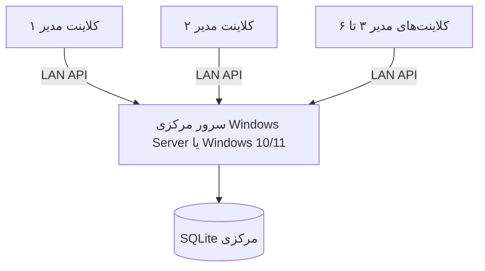

# معماری فنی

## توپولوژی استقرار

کلاینت، نرم‌افزار بومی Qt است و هیچ مرورگر یا موتور وبی اجرا نمی‌کند. عبارت API فقط مسیر ارتباط TLS نرم‌افزار نصب‌شده با سرویس مرکزی روی شبکه داخلی است.

## لایه‌ها

- `client.py`: پوسته دسکتاپ، صفحه ورود، داشبورد، پرسنل، چارت و مدیریت.
- `api_client.py`: ارتباط JSON/TLS، pinning اثرانگشت، timeout و مدیریت خطا.
- `server.py`: HTTPS داخلی، احراز هویت، MFA، کنترل دسترسی و endpointها.
- `database.py`: مدل مرکزی، تراکنش، کنترل نسخه، RBAC، workflow و ممیزی.
- `migrations.py`: migrationهای ترتیبی و کنترل checksum.
- `operations.py`: پشتیبان زمان‌بندی‌شده، بازیابی، لاگ و health operations.
- `windows_service.py`: اجرای دائمی سرویس مرکزی زیر Windows Service Control Manager.

## هم‌زمانی

هر رکورد `row_version` دارد. مدیر هنگام ذخیره همان نسخه‌ای را می‌فرستد که خوانده است. اگر مدیر دیگری رکورد را تغییر داده باشد، سرور پاسخ تعارض می‌دهد و داده جدید بدون اطلاع بازنویسی نمی‌شود. هر تغییر همچنین یک شماره افزایشی در `change_feed` می‌سازد؛ کلاینت‌ها آن را دوره‌ای بررسی و نمای فعال را تازه می‌کنند.

## توسعه ماژول‌ها

صفحه‌های Qt از کلاس پایه `Page` ساخته و در `MainWindow` ثبت می‌شوند. ویجت‌های داشبورد داده‌محور هستند و از داخل برنامه قابل افزودن، ویرایش و حذف‌اند. برای افزودن بخش جدید، یک Page مستقل ساخته و آن را به تعریف ناوبری اضافه کنید.

## مسیر ارتقا دیتابیس

نسخه schema در `metadata` و سابقه اجرای آن در `schema_migrations` نگهداری می‌شود. هر migration شماره، نام و SHA-256 ثابت دارد؛ تغییر migration اجراشده باعث توقف امن startup می‌شود. عملیات هر migration در تراکنش جدا اجرا می‌شود.
